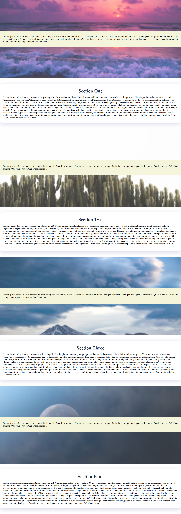

# Parallax Webpage



A modern, responsive parallax scrolling webpage featuring smooth background animations and glassmorphism design elements.

## Features

- **Parallax Scrolling**: Fixed background images that create depth and visual interest as users scroll
- **Glassmorphism Design**: Semi-transparent cards with blur effects and subtle shadows
- **Responsive Layout**: Fully responsive design that works across different screen sizes
- **Smooth Animations**: Hover effects with scale and shadow transitions
- **Modern CSS**: Uses CSS3 features including backdrop-filter, transforms, and flexbox

## Structure

The webpage consists of alternating parallax background sections and content cards:

- **4 Parallax Sections**: Full-viewport height backgrounds with fixed attachment
- **4 Content Sections**: Glassmorphism-styled cards with hover effects
- **Blur Overlays**: Subtle backdrop blur effects on parallax backgrounds

## Technologies Used

- HTML5
- CSS3 (Flexbox, Transforms, Backdrop Filters)
- Unsplash Images (for background photos)

## Getting Started

1. Clone or download the project files
2. Open `index.html` in your web browser
3. Scroll to experience the parallax effects

## File Structure

```
├── index.html          # Main HTML file with embedded CSS
├── Parallax-Webpage.png # Project preview image
└── README.md           # This file
```

## CSS Features

### Parallax Effect
- `background-attachment: fixed` creates the parallax scrolling effect
- Background images are sourced from Unsplash for high-quality visuals

### Glassmorphism Cards
- Semi-transparent backgrounds with `rgba(255, 255, 255, 0.85)`
- Backdrop blur effects using `backdrop-filter: blur(2px)`
- Rounded corners and subtle box shadows
- Smooth hover animations with scale and shadow changes

### Responsive Design
- Viewport-based units (vh, vw) for consistent sizing
- Flexbox for centering and layout
- Box-sizing border-box for predictable sizing

## Browser Compatibility

- Modern browsers with CSS3 support
- Backdrop-filter requires recent browser versions
- Parallax effects work best on desktop browsers

## Customization

To customize the webpage:

1. **Change Background Images**: Replace the Unsplash URLs in the CSS with your own images
2. **Modify Colors**: Update the color scheme in the CSS variables
3. **Adjust Content**: Replace the Lorem ipsum text with your own content
4. **Add Sections**: Follow the existing pattern to add more parallax/content sections

## Performance Notes

- Background images are loaded from external URLs (Unsplash)
- Consider hosting images locally for better performance
- Parallax effects may impact performance on mobile devices

## License

This project is open source and available under the MIT License.